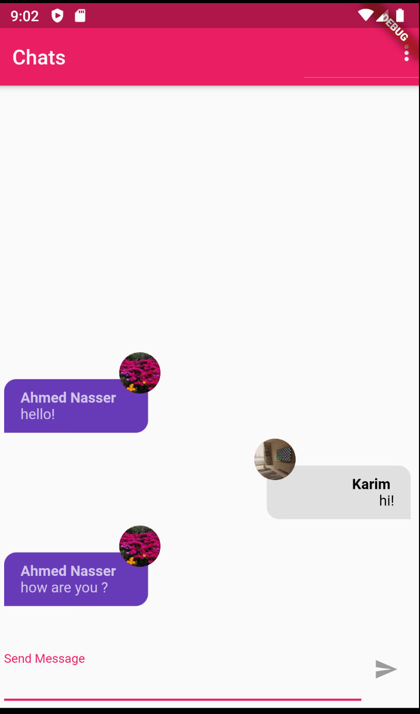

# chat_app

A Simple Chat App  

***This App uses***:
1. Firebase FileStore (save chats)
1. Firebase Auth (auth users)
1. Firebase Storge (save users images)
1. Firebase messaging (Push Notifications) 
1. Firebase Function  (Trigger Push Notifications )

## Getting Started

This project is a starting point for a Flutter application.

A few resources to get you started if this is your first Flutter project:

- [Lab: Write your first Flutter app](https://flutter.dev/docs/get-started/codelab)
- [Cookbook: Useful Flutter samples](https://flutter.dev/docs/cookbook)

For help getting started with Flutter, view our
[online documentation](https://flutter.dev/docs), which offers tutorials,
samples, guidance on mobile development, and a full API reference.
